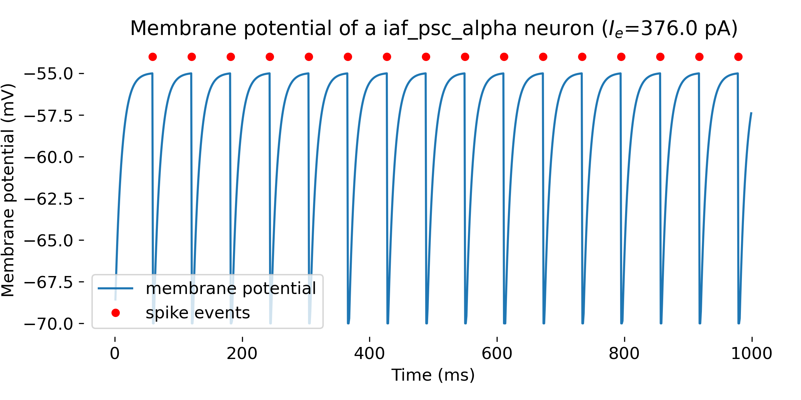

# NEST Simulator tutorials

This is a collection of tutorials showing how to use the [NEST Simulator](https://nest-simulator.readthedocs.io/en/stable/index.html). You can find a detailed description for each tutorial in the following blog posts:

* [NEST simulator – A powerful tool for simulating large-scale spiking neural networks](https://www.fabriziomusacchio.com/blog/2024-06-09-nest_SNN_simulator/)
* [Step-by-step NEST single neuron simulation](https://www.fabriziomusacchio.com/blog/2024-06-16-nest_single_neuron_example/)
* [Connection concepts in NEST](https://www.fabriziomusacchio.com/blog/2024-06-25-nest_connection_concepts/)
* [Izhikevich SNN simulated with NEST](https://www.fabriziomusacchio.com/blog/2024-06-30-nest_izhikevich_snn/)
* [Oscillatory population dynamics of GIF neurons simulated with NEST](https://www.fabriziomusacchio.com/blog/2024-07-14-oscillating_gif_neuron_population/)
* [Brunel network: A comprehensive framework for studying neural network dynamics](https://www.fabriziomusacchio.com/blog/2024-07-21-brunel_network/)


For reproducibility:

```bash
conda create -n nest -y python=3.11
conda activate nest
conda install -c conda-forge -y mamba
mamba install -y ipykernel matplotlib numpy pandas nest-simulator
```


